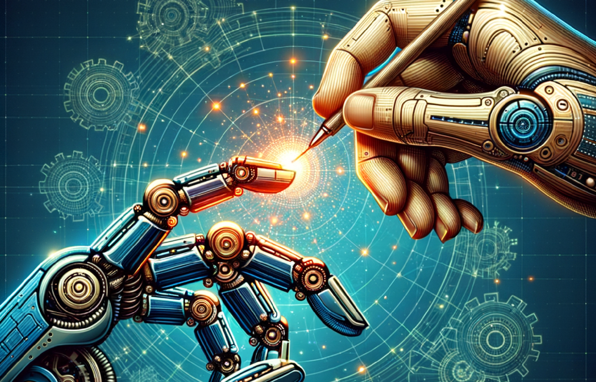

> In the rapidly evolving world of robotics, one particular challenge stands tall: How can we make a
> robot hand perform tasks with the same level of dexterity and precision as a human hand? This is
> where Hand Retargeting comes into the picture.

## Why Do We Need Hand Retargeting?

In the realm of robotics, 'teleoperation' refers to the operation of a robot with control command
from human.
Teleoperation often involves a human operator controlling the movements of a robot. In an ideal
world, the robot would mimic the operator's movements perfectly, making the operation seamless and
intuitive. But here's the catch: human hands and robot hands are fundamentally different. They have
different 'morphologies' - that is, shapes and degree of freedom. This difference in morphology
makes it challenging to map human hand movements onto robot hands, limiting the effectiveness of
teleoperation.

This is where hand retargeting becomes essential. It provides a way to bridge this gap and make
teleoperation more intuitive and effective, even when the morphologies of the hands are different.

## What is Hand Retargeting?

Hand retargeting is the process of mapping movements from one hand morphology to another. It's a
concept that has its roots in computer graphics, where it's often used to map movements from a human
actor to a digitally created character. In the context of robotics, we use hand retargeting to map
movements from a human hand to a robot hand.

The goal of hand retargeting is to create a 'mapping' that allows the robot hand to mimic the human
hand's movements as closely as possible. This mapping takes into account the differences in size,
shape, and joint structure between the human and robot hands and finds the best way to 'translate'
movements from one to the other.

## Common Approaches to Hand Retargeting

There are several common approaches to hand retargeting, each with its strengths and weaknesses:

1. **Direct Mapping:** This is the most straightforward approach, where each joint of the human hand
   is mapped to a corresponding joint on the robot hand. This method is simple to implement but may
   not produce the best results if the morphologies of the two hands are very different.

2. **Kinematic Mapping:** This approach uses the principles of kinematics - the branch of physics
   that deals with motion - to map movements between the hands. This can produce more accurate and
   realistic results than direct mapping, but it is also more complex.

3. **Machine Learning Approaches:** Recently, machine learning techniques have been applied to hand
   retargeting. These techniques train a model to learn the mapping between the human and robot
   hands, often producing very accurate results. However, they require a significant amount of data
   and computational resources.

---

In the upcoming sections, we will delve deeper into these techniques and explore how they could be
applied in different scenarios. Stay tuned!

---
