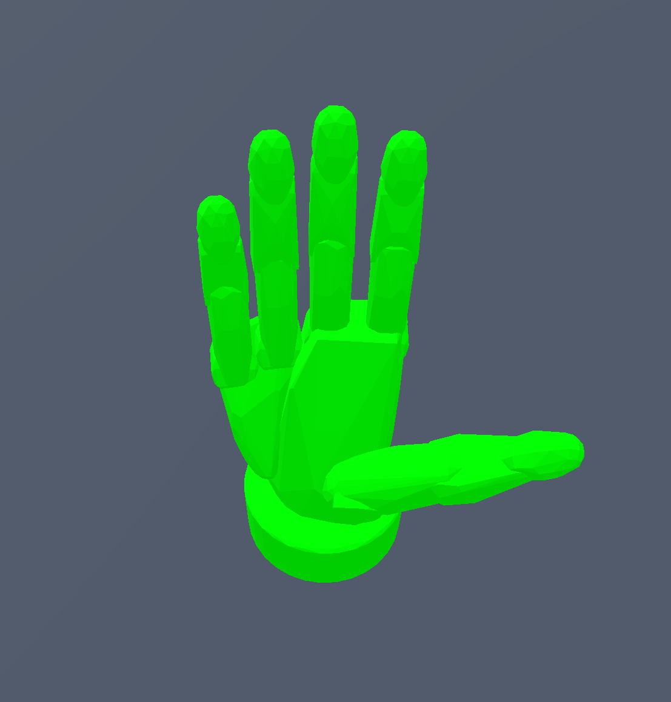
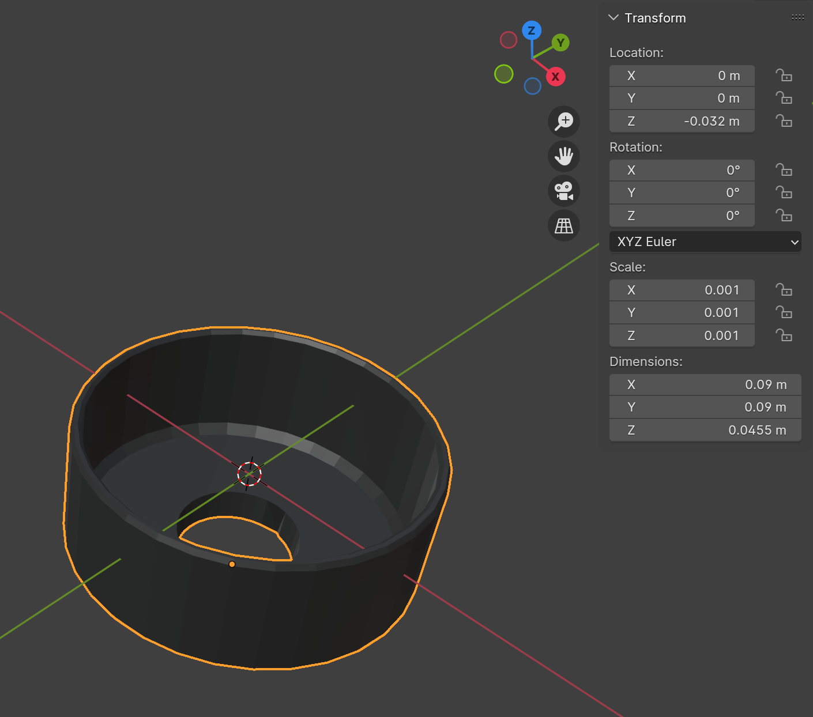
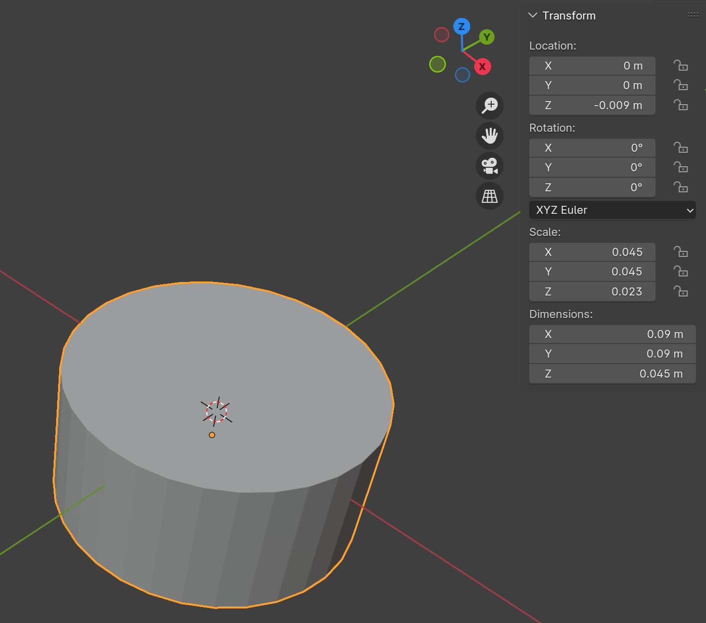
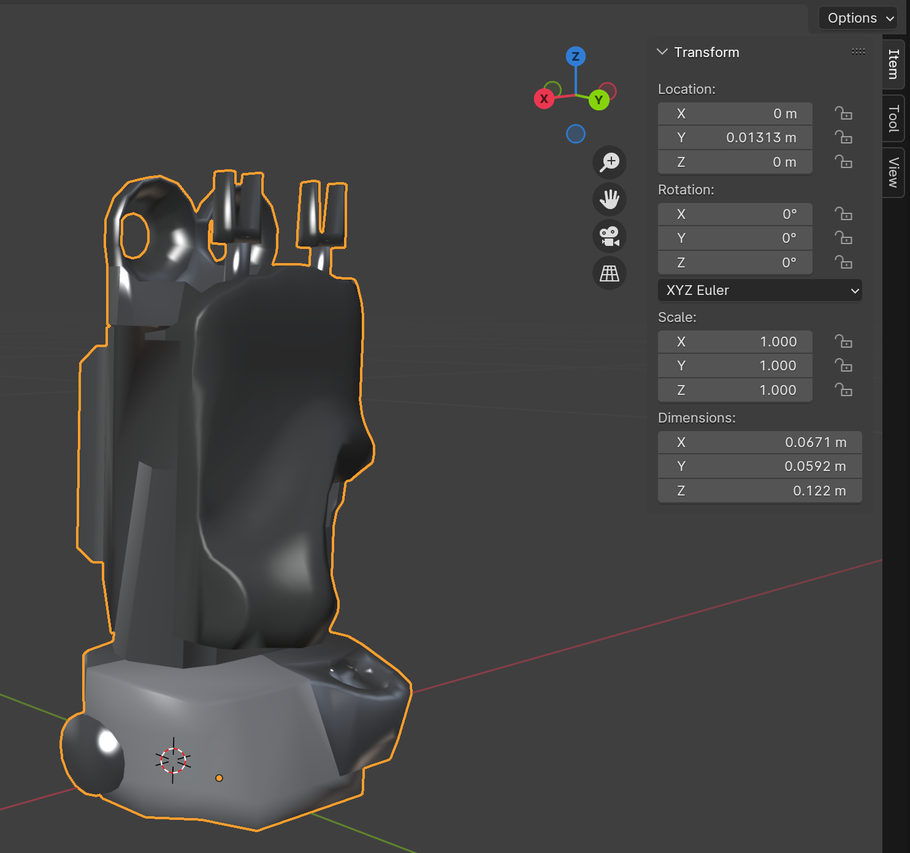
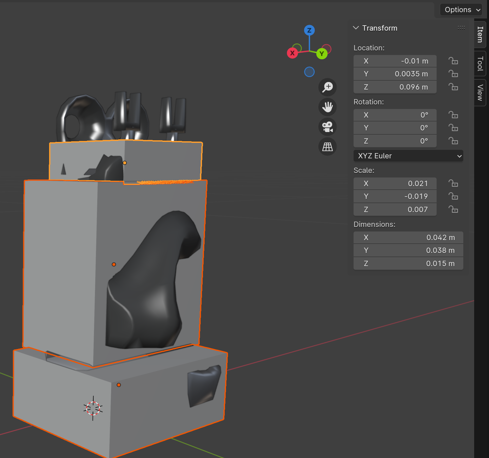

> In the intricate world of robotics and physical simulation, the devil is often in the details. A
> well-designed robot can perform a wide array of tasks in the real world, but to do so accurately
> in a simulated environment, we need to pay close attention to one critical aspect: **the
collision mesh**.

## Understanding Collision Mesh for Robot

A collision mesh is a streamlined geometric model employed for physical simulation. Unlike the
visual mesh (the representation we observe on the screen), a collision mesh is utilized to detect
collisions and calculate contact between objects within a physics engine. In a `.urdf` file, the
collision mesh is defined within the `<collision>` tag, distinct from the visual mesh.

The precision of our collision mesh in mirroring the actual shape of the robot hand significantly
influences the accuracy of our simulation's predictions and responses to interactions, thereby
enhancing realism.
However, the quest for a highly realistic collision mesh can demand substantial computational
resources. **Meshes with higher realism often contain more vertices and faces**, which can notably
increase the computational requirements for running the simulation. This could potentially slow down
the simulation. Sometimes, it might be beneficial to ignore minor physical details in the
simulation to simplify the problem.

Consequently, crafting a collision mesh for a robot is a non-trivial task. This complexity is
especially amplified in the case of dexterous hands, which possess a much larger number of links
compared to a robot arm. The task demands thorough attention and cannot be completely automated via
scripting.

In this blog, we will navigate through this challenge. By utilizing a specific robot hand as
example, we will illustrate the step-by-step process of creating collision mesh for a robot hand.

## Example: Creating a Model for the SVH Hand

In this tutorial, we are going to walk you through a detailed process of creating a collision mesh
model using the manufacturer-provided URDF, specifically for
the [SCHUNK SVH Hand](https://github.com/SCHUNK-SE-Co-KG/schunk_svh_ros_driver/tree/main/schunk_svh_description/urdf).
The original URDF from SCHUNK employs the same mesh file for collision as well as visual
representation. This approach could lead to significant issues as many simulators often default to
converting the imported collision mesh into a convex hull.

Below, we present the collision mesh derived from the original URDF. The left image depicts the
original collision geometry, while the right one represents the contact force of self-penetration
during motion. As you can intuitively imagine, loading this model directly into your simulator
would lead to unpredictable behavior due to the self-collision causing random movement. The red
arrow indicates the contact force, with deeper red signifying greater force. You can visualize this
using
the [ContactViewer](https://github.com/dexsuite/dex-urdf/blob/fc3c16cf255604078ff7f08ba08d8cacc31a3b3e/example/render_urdf_sapien.py#L35)
tool.

|               Collision Mesh                |      Weired Motion from  Self Collision      |
|:-------------------------------------------:|:--------------------------------------------:|
|  |  |

To address the problem identified above, we'll manually remodel the collision mesh. There are
several methods for this, such as using primitives like a box or sphere for collision
representation, employing convex decomposition derived from the visual mesh, or even designing a
more tailored solution. You may wish to understand more about convex decomposition from this post.

### Building a Collision Mesh: Single Primitive Approach

Let's start with the base, corresponding to `base10.dae`.

:::warning
It's important to note that using a `.dae` file to represent a visual mesh can lead to
inconsistencies across different URDF parsers. This is why DexSuite does not use `.dae` files for
visual meshes. While this is not the main focus of this blog post, we thought it was worth
mentioning.
:::

Next, import the visual mesh into your preferred graphics software, such as Blender. We notice that
the shape of this mesh closely resembles a cylinder. Therefore, let's attempt to use a cylinder to
represent the collision mesh. Usually, it's more efficient to use a primitive than a mesh file for
collision representation.

```xml

<visual>
    <origin rpy="0 0 0" xyz="0 0 -0.032"/>
    <geometry>
        <mesh filename="package://schunk_svh_description/meshes/base10.dae"/>
    </geometry>
</visual>
```

Remember to position the visual mesh in Blender based on the pose tag within the URDF, which has
a `z=-0.032` position. Then, create a cylinder primitive and adjust its size and position to align
with the visual mesh.

|  Visual Mesh in Blender   | Created Cylinder Primitive in Blender |
|:-------------------------:|:-------------------------------------:|
|  |          |

Afterward, we can copy-paste the cylinder information into the URDF as illustrated below. When you
load the modified URDF into your simulator, the collision mesh will now be represented by a
simple cylinder.

```xml

<link name="right_hand_base_link">
    <origin rpy="0 0 0" xyz="0 0 0"/>
    <visual>
        <origin rpy="0 0 0" xyz="0 0 -0.032"/>
        <geometry>
            <mesh filename="meshes/visual/base10.obj"/>
        </geometry>
    </visual>
    <collision>
        <origin rpy="0 0 0" xyz="0 0 -0.009"/>
        <geometry>
            <cylinder radius="0.045" length="0.045"/>
        </geometry>
    </collision>
</link>
```

:::tip
Several simulators, like SAPIEN, IsaacGym, and IsaacSim, do not include a cylinder as a built-in
primitive. Hence, the URDF parser will interpret the cylinder as a triangle mesh internally. This
implies that for a cylinder, using a cylinder primitive in URDF or saving it as a mesh file will
yield identical results in simulation collision detection. However, for simplicity, we recommend
using the `<cylinder>` tag.
:::

### Building a Collision Mesh: Multi Primitive Approach

Now, let's handle the palm, which corresponds to `h10.dae` and `h11.dae`. We'll begin with h10.
This part has a more complex structure than the previous ones, and it appears that a single
primitive cannot approximate it. Instead, we might need to use multiple primitives, such as three
boxes.

| Visual Mesh in Blender | Created Box Primitives in Blender |
|:----------------------:|:---------------------------------:|
|     |            |

**Why are some parts of the visual mesh not covered by the boxes, and why are others over-covered?**

**Over-coverage Reasoning:**
Typically, the collision mesh can be slightly larger than the actual shape for safety
considerations. For instance, we expect our robot to manipulate objects with its fingers, not the
hand base. The collision mesh for this part is primarily designed to prevent unwanted penetration,
between the hand and the object, or between the hand and the robot arm.

**Under-coverage Reasoning:**
For parts under-covered by the box, finger links are usually present, making these areas hard to
reach for external objects. Moreover, the visual mesh does not represent the actual robot; it merely
serves as a surrogate for its real counterpart that we do not need to follow precisely. In practice,
modeling this uncovered part could lead to unwanted self-collision in the initial state.

Following the same design principle, we can also model the collision mesh corresponding to `h11`.
However, this is a complex design problem, and there isn't a unique solution for design. You'll
often find that the design choices are heavily dependent on your manipulation task with the robot
model. Remember, the modeling process is always iterative: you build collision meshes and put them
into a simulator to observe the outcomes. If something unexpected occurs, such as undesired
self-collision, you should update your collision mesh design.

When building models in DexSuite, we extensively
use [simulation for motion checking](https://github.com/dexsuite/dex-urdf/blob/main/example/render_urdf_sapien.py)
to enhance the modeling process.
