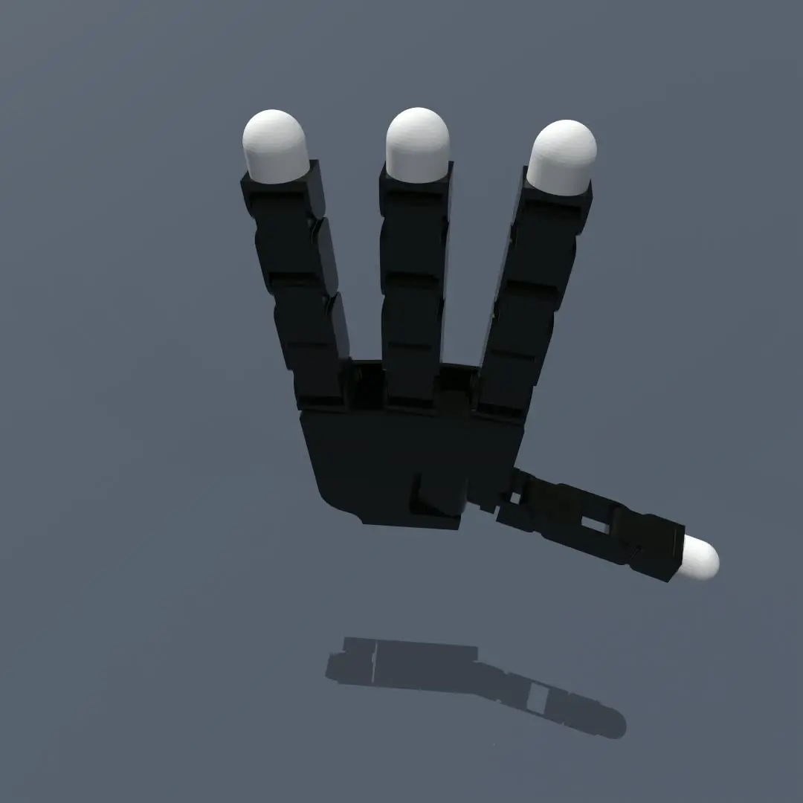
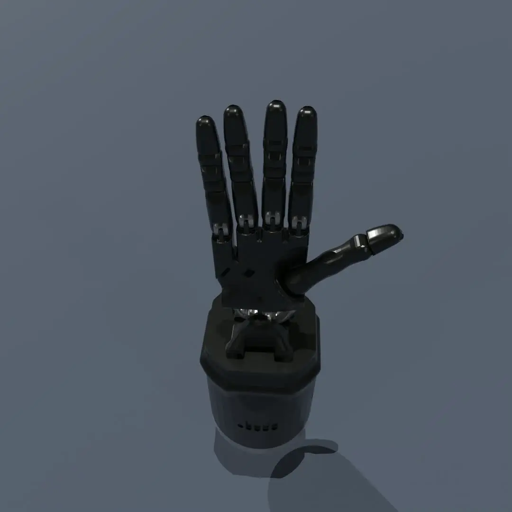
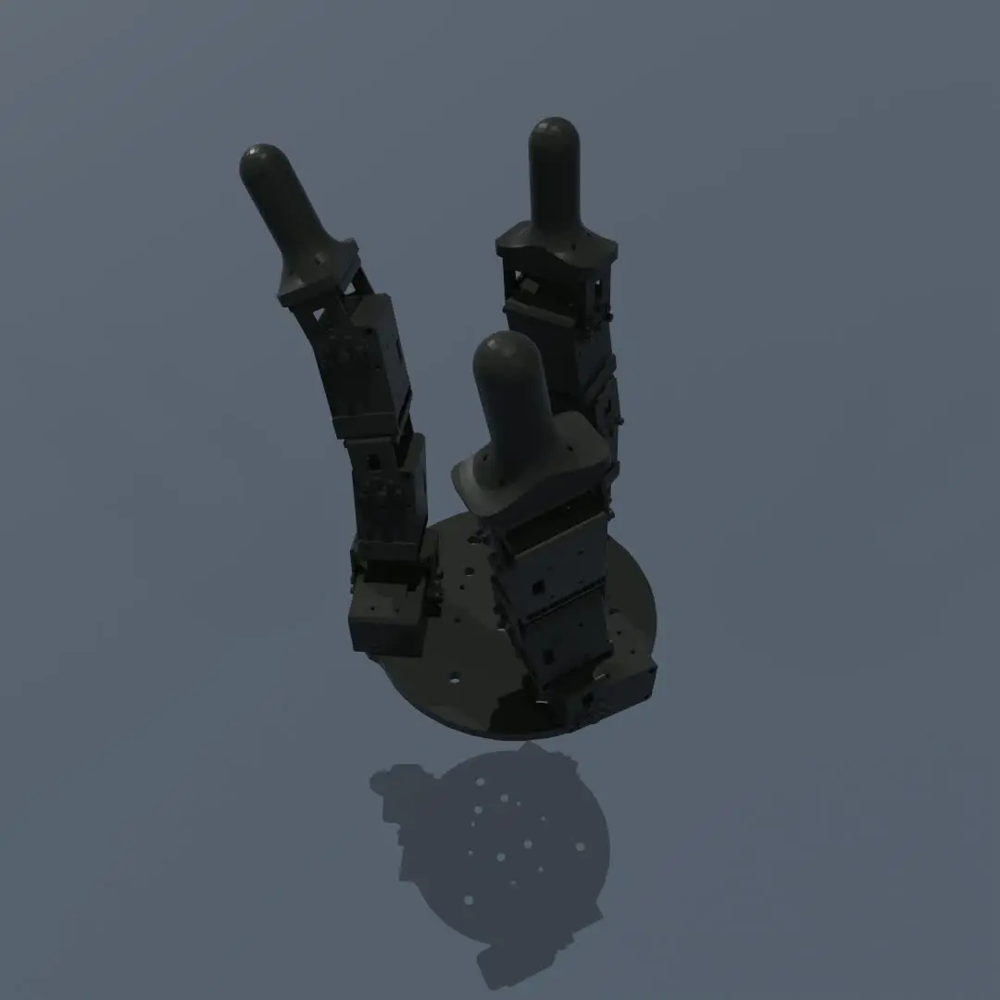

# Models in DexSuite

DexSuite offers a set of high-quality models of dexterous robotic hands and objects, ideal for hand
manipulation,
formatted in [URDF](https://formant.io/urdf/). These models have been tested in several physical
simulators. You can
also obtain the models from our [Github Repository](https://github.com/dexsuite/dex-urdf).

## Robot URDF Models

|                  **Allegro Hand**                  |                **Shadow Hand**                |             **SCUUNK SVH**             |
|:--------------------------------------------------:|:---------------------------------------------:|:--------------------------------------:|
|  |  |  |
|                  **Ability Hand**                  |               **Barrett Hand**                |          **SCHUNK SVH Hand**           |

### Why we need these robot models?

Several of the robot models, based on the URDF, have been adapted from the original URDF supplied by
the manufacturer.
You might question the need to use these models over the original URDF. The reason is that while the
URDF format was
initially designed to represent robot models, it wasn't specifically tailored for simulation. The
primary use of URDF
was intended for [ROS](https://www.ros.org/), for instance, visualization
in [rviz](http://wiki.ros.org/rviz) or
kinematics computation with [MoveIt](https://moveit.ros.org/). Currently, many physical simulators
also employ URDF to
load robot models, and simulation demands a higher standard of model quality compared to kinematics
computation.

We've made several improvement to the original models provided by the manufacturers:

- Better collision mesh
- Better visual mesh
- Better inertia and joint parameters
- Uniform URDF parsing across diverse parsers
- Standardized frame convention
- Added auxiliary links
- Variation model, e.g. with contact sensor

### Source and license

|   Robot Model   |                          Official Website                           |                                                 URDF Source                                                 |                                    CAD Model Source                                    |  License   |
|:---------------:|:-------------------------------------------------------------------:|:-----------------------------------------------------------------------------------------------------------:|:--------------------------------------------------------------------------------------:|:----------:|
|  Allegro Hand   | [Wonik Robotics](https://www.wonikrobotics.com/research-robot-hand) | [allegro_hand_ros](https://github.com/simlabrobotics/allegro_hand_ros/tree/master/allegro_hand_description) |                                          N/A                                           |    BSD     |
| SCHUNK SVH Hand |                 [SCHUNK](https://schunk.com/us/en)                  |             [schunk_svh_ros_driver](https://github.com/SCHUNK-GmbH-Co-KG/schunk_svh_ros_driver)             |                                          N/A                                           | Apache-2.0 |
|   Shadow Hand   |        [Shadow Robot Company](https://www.shadowrobot.com/)         |                     [schunk_svh_ros_driver](https://github.com/shadow-robot/sr_common)                      |                                          N/A                                           |  GPL-3.0   |
|   Robel DClaw   |     [Robel Benchmark](https://github.com/google-research/robel)     |                                                     N/A                                                     | [D'Claw CAD](https://drive.google.com/drive/folders/1H1xN5BU03-eXjuEyIL_iJ_4XzrdDSnlM) | Apache-2.0 |
|  Barrett Hand   |  [Barrett Technology](http://barrett.com/robot/products-hand.html)  |                        [bhand_model](https://github.com/jhu-lcsr-attic/bhand_model)                         |    [BarrettHand CAD](https://github.com/jhu-lcsr-attic/bhand_model/tree/master/cad)    |    BSD     |
|  Ability Hand   |                 [PSYONIC](https://www.psyonic.io/)                  |                     [ability-hand-api](https://github.com/psyonicinc/ability-hand-api)                      |                                          N/A                                           |    N/A     |